# Бенчмарки

## Параметры бенчмарка

- размер данных для построения: `10_000`, `100_000`, `300_000`
- размер данных для поиска: `10_000`, `100_000`, `1_000_000`
- радиус: `0.1`, `1.0`, `10.0`
- `QUERY_COUNT = 500`
- прогрев: `3 x 500 ms`
- измерение: `5 x 500 ms`

Графики ниже построены по тем же данным, что и таблицы. `Error bars` показывают оценку погрешности JMH: для времени и пропускной способности это `Score Error (99,9%)`, для памяти - погрешность метрики `gc.alloc.rate.norm` из `-prof gc`.

## Время построения

| Размер данных | Полный перебор, ms/op | Quadtree, ms/op | Quadtree / полный перебор |
|---:|---:|---:|---:|
| 10000 | 0.035 | 0.582 | 16.49x |
| 100000 | 0.424 | 11.208 | 26.40x |
| 300000 | 1.336 | 48.303 | 36.17x |

### График

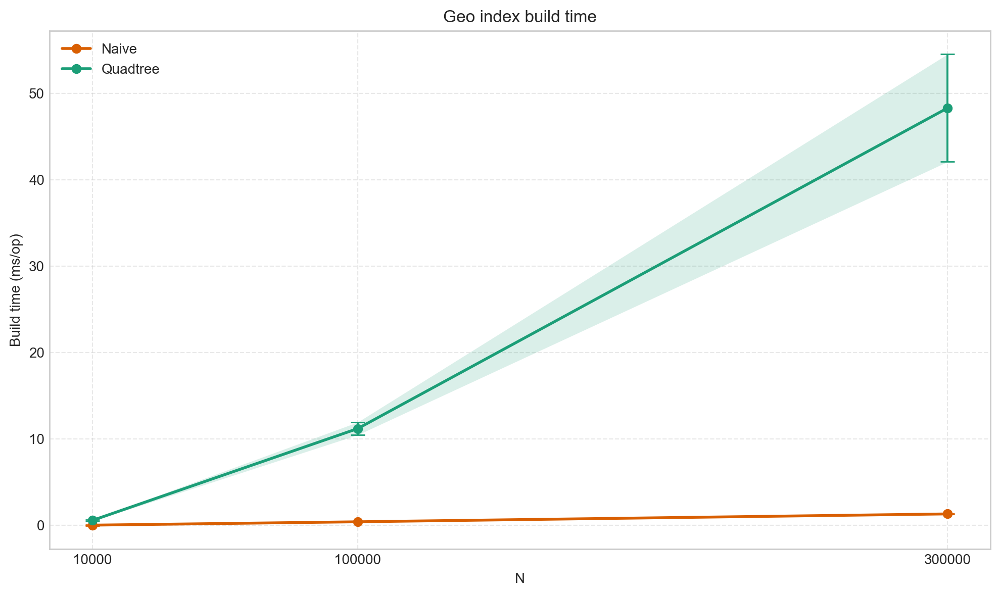

*Рис. 1. Время построения индекса в зависимости от размера набора данных. Для Quadtree построение заметно дороже полного перебора и разрыв растет вместе с размером входа.*

## Среднее время поиска

| Размер данных | Радиус | Полный перебор, us/op | Quadtree, us/op | Ускорение Quadtree |
|---:|---:|---:|---:|---:|
| 10000 | 0.1 | 10.012 | 0.060 | 166.46x |
| 10000 | 1.0 | 10.154 | 0.087 | 116.79x |
| 10000 | 10.0 | 11.961 | 1.220 | 9.80x |
| 100000 | 0.1 | 99.962 | 0.086 | 1157.18x |
| 100000 | 1.0 | 98.143 | 0.247 | 396.85x |
| 100000 | 10.0 | 150.103 | 10.591 | 14.17x |
| 1000000 | 0.1 | 1051.646 | 0.138 | 7636.95x |
| 1000000 | 1.0 | 1307.509 | 1.591 | 821.65x |
| 1000000 | 10.0 | 2329.089 | 141.328 | 16.48x |

### Графики по радиусу

#### Радиус `0.1`

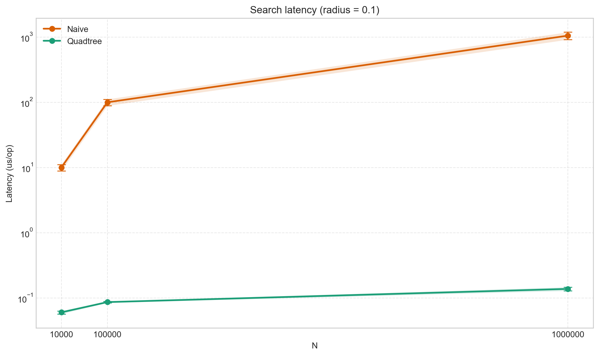

*Рис. 2. Среднее время одного поискового запроса при радиусе `0.1`. По оси `Y` используется логарифмическая шкала, чтобы на одном графике были видны и `Naive`, и `Quadtree`.*

#### Радиус `1.0`

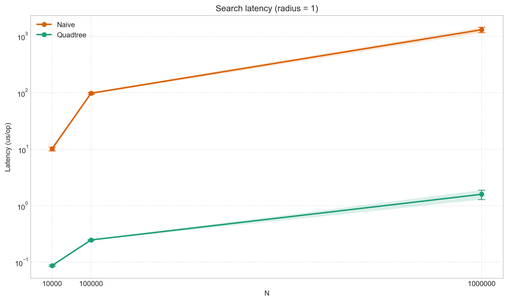

*Рис. 3. Среднее время одного поискового запроса при радиусе `1.0`. Quadtree сохраняет существенное преимущество на всех размерах данных.*

#### Радиус `10.0`

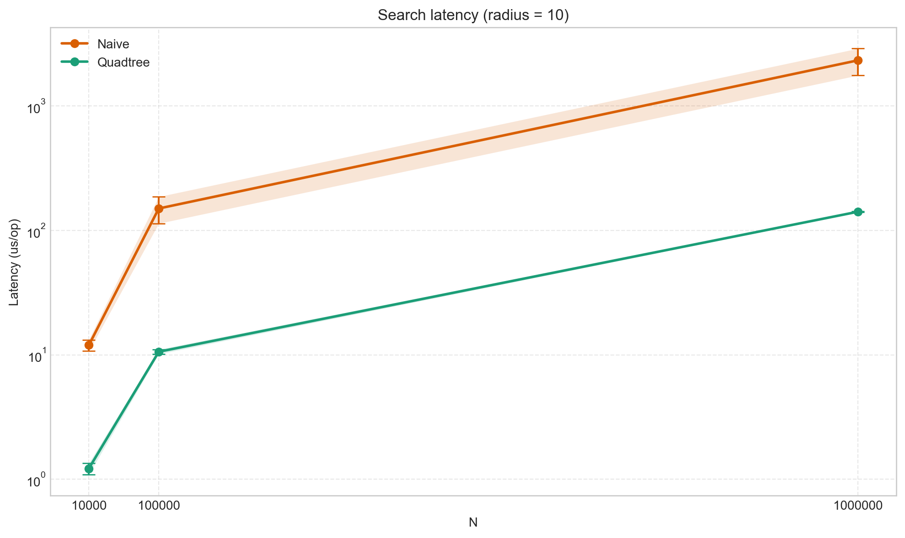

*Рис. 4. Среднее время одного поискового запроса при радиусе `10.0`. При большем радиусе разница между структурами уменьшается, но Quadtree все еще быстрее.*

## Пропускная способность поиска

| Размер данных | Радиус | Полный перебор, ops/s | Quadtree, ops/s | Ускорение Quadtree |
|---:|---:|---:|---:|---:|
| 10000 | 0.1 | 85,505 | 16,792,673 | 196.39x |
| 10000 | 1.0 | 84,026 | 11,354,084 | 135.13x |
| 10000 | 10.0 | 79,403 | 847,286 | 10.67x |
| 100000 | 0.1 | 8,625 | 11,637,326 | 1349.30x |
| 100000 | 1.0 | 7,691 | 4,048,709 | 526.44x |
| 100000 | 10.0 | 6,754 | 93,772 | 13.88x |
| 1000000 | 0.1 | 724 | 6,868,886 | 9492.34x |
| 1000000 | 1.0 | 706 | 662,661 | 938.19x |
| 1000000 | 10.0 | 802 | 4,977 | 6.20x |

### Графики по радиусу

#### Радиус `0.1`

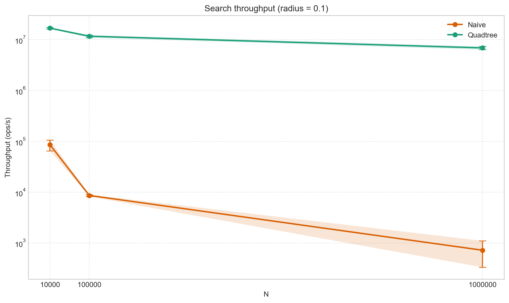

*Рис. 5. Пропускная способность поиска при радиусе `0.1`. На малом радиусе Quadtree обрабатывает на порядки больше запросов в секунду.*

#### Радиус `1.0`

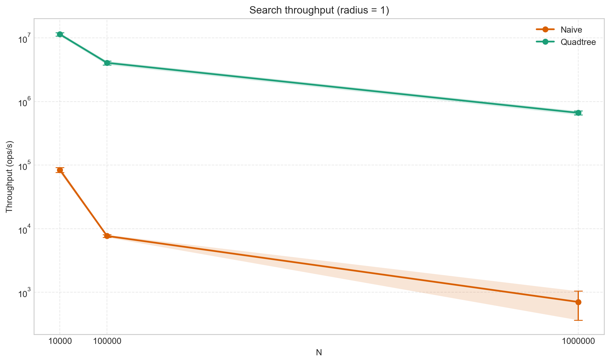

*Рис. 6. Пропускная способность поиска при радиусе `1.0`. Разница между реализациями остается очень заметной даже на больших размерах данных.*

#### Радиус `10.0`

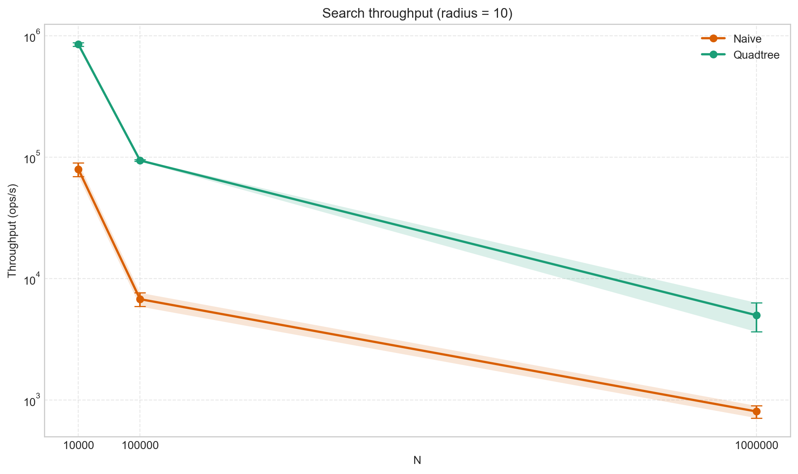

*Рис. 7. Пропускная способность поиска при радиусе `10.0`. При расширении области поиска выигрыш Quadtree снижается, что согласуется с ростом latency.*

## Память

`gc.alloc.rate.norm` из JMH `-prof gc`.

| Размер данных | Радиус | Полный перебор, B/op | Quadtree, B/op | Во сколько Quadtree больше |
|---:|---:|---:|---:|---:|
| 10000 | 0.1 | 24.2 | 299.6 | 12.36x |
| 10000 | 1.0 | 46.1 | 400.4 | 8.69x |
| 10000 | 10.0 | 744.9 | 3189.5 | 4.28x |
| 100000 | 0.1 | 27.8 | 361.0 | 13.01x |
| 100000 | 1.0 | 81.4 | 671.6 | 8.25x |
| 100000 | 10.0 | 6600.3 | 24019.8 | 3.64x |
| 1000000 | 0.1 | 59.1 | 508.4 | 8.60x |
| 1000000 | 1.0 | 777.8 | 3331.7 | 4.28x |
| 1000000 | 10.0 | 73220.5 | 227059.6 | 3.10x |

### Графики по радиусу

#### Радиус `0.1`

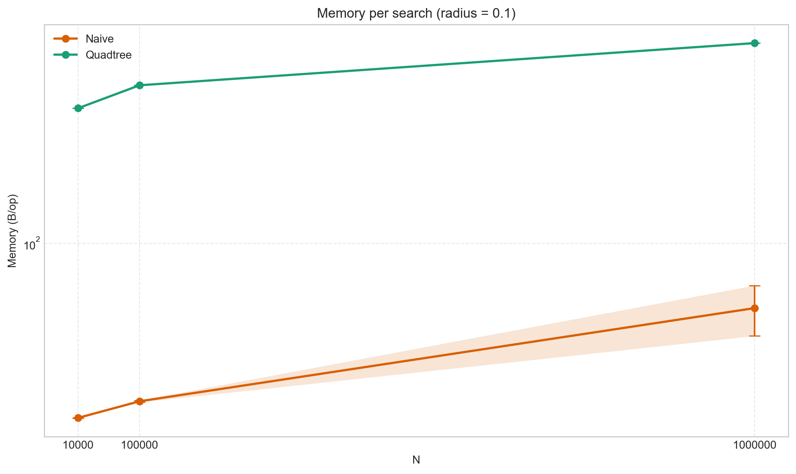

*Рис. 8. Объем аллокаций на один запрос при радиусе `0.1` в `B/op`. Quadtree требует больше памяти, чем полный перебор, даже когда выигрывает по времени.*

#### Радиус `1.0`

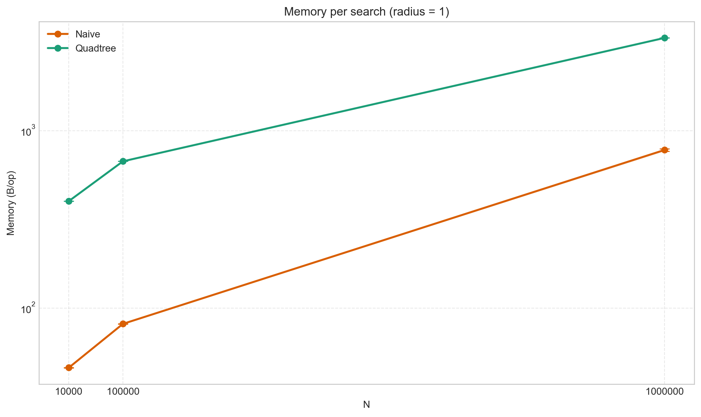

*Рис. 9. Объем аллокаций на один запрос при радиусе `1.0`. Профиль памяти подтверждает компромисс: ускорение достигается ценой дополнительных аллокаций.*

#### Радиус `10.0`

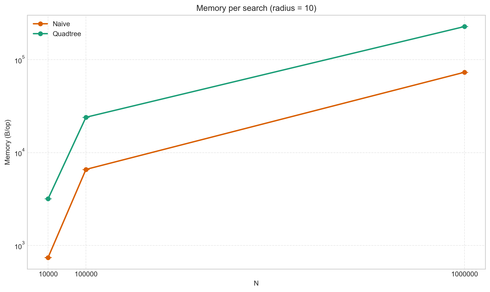

*Рис. 10. Объем аллокаций на один запрос при радиусе `10.0`. С ростом радиуса стоимость Quadtree по памяти увеличивается особенно заметно.*

## Профилирование

Скриншоты ниже дополняют численные результаты бенчмарков и показывают, где именно тратится время процессора и где возникают основные аллокации.

### CPU-профиль построения Quadtree

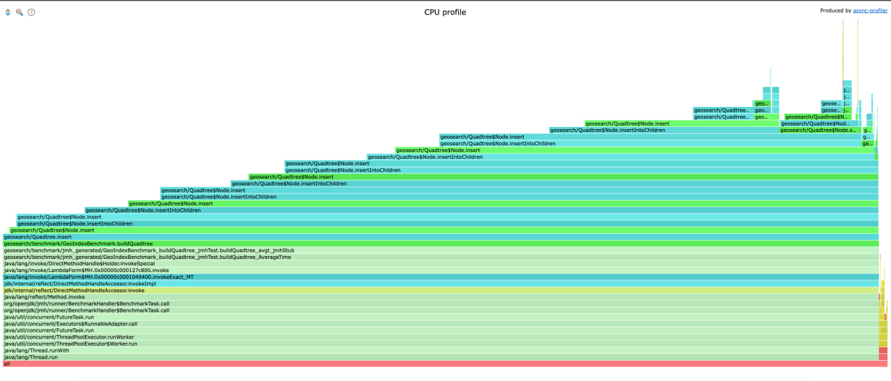

*Рис. 11. CPU flame graph для построения Quadtree. Основная часть времени уходит в `QuadtreeNode.insert` и `QuadtreeNode.insertIntoChildren`, что хорошо согласуется с высокой стоимостью построения индекса по сравнению с полным перебором.*

### CPU-профиль поиска в Quadtree

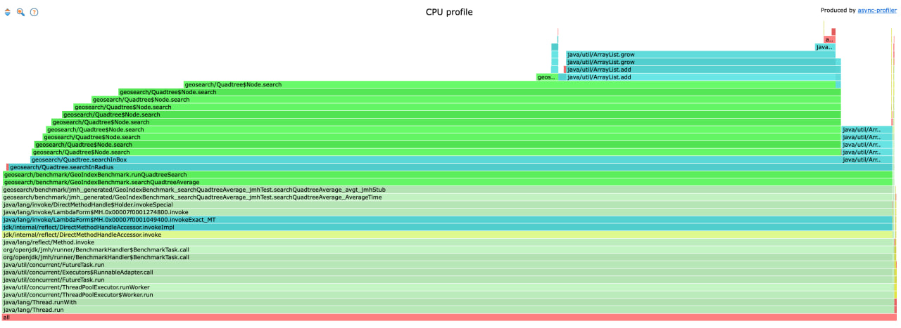

*Рис. 12. CPU flame graph для поиска в Quadtree. Наиболее заметны вызовы `QuadtreeNode.search`, а также операции `ArrayList.add` и `ArrayList.grow`, связанные с формированием списка найденных точек.*

### Профиль аллокаций при поиске

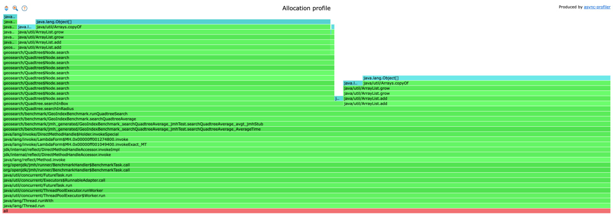

*Рис. 13. Allocation flame graph для поиска. Наибольший вклад в выделение памяти дают `ArrayList.add`, `ArrayList.grow` и `Arrays.copyOf`, то есть рост результирующих списков при накоплении найденных элементов.*
