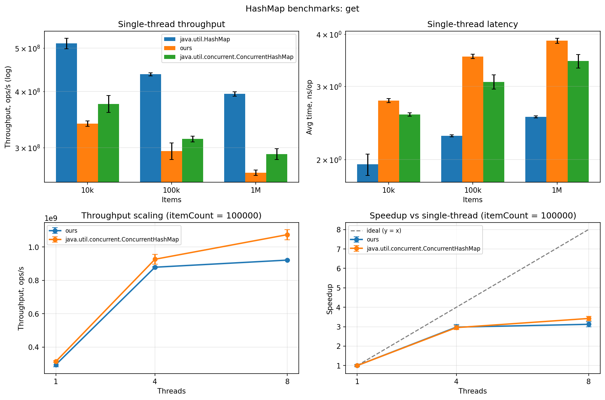
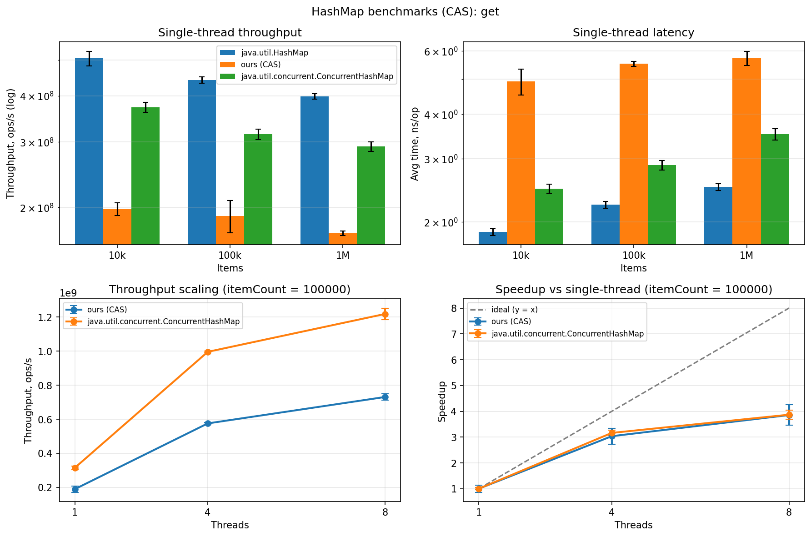
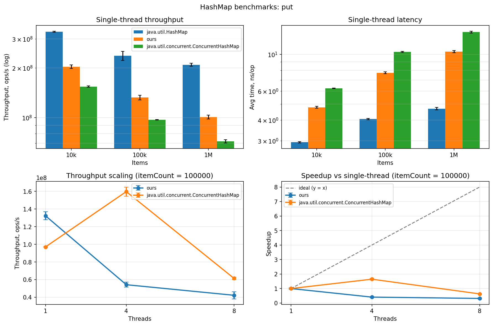
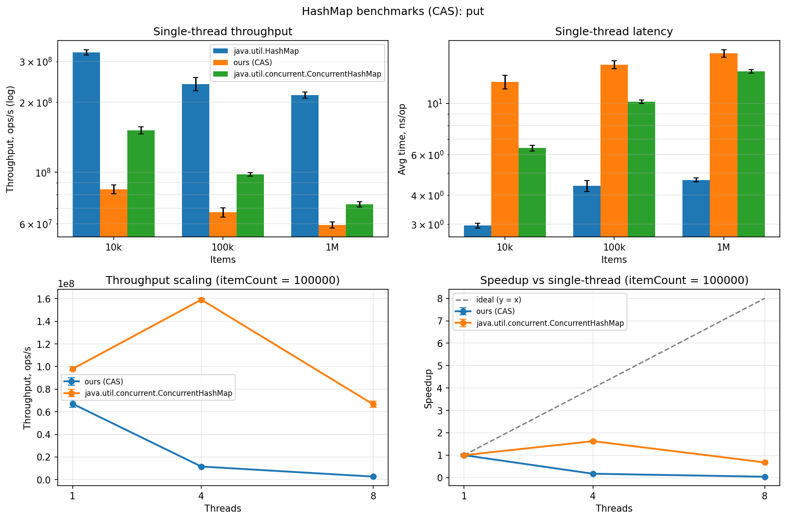
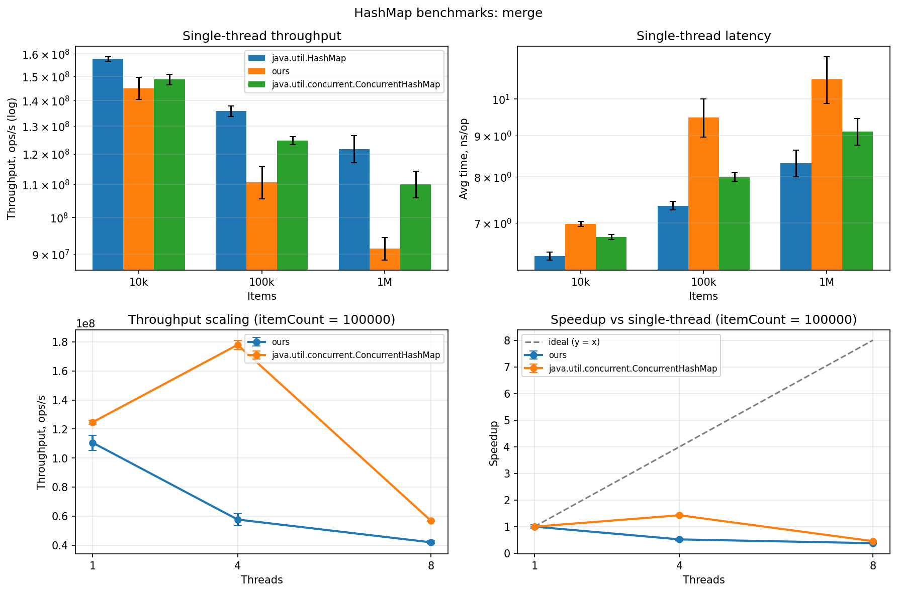
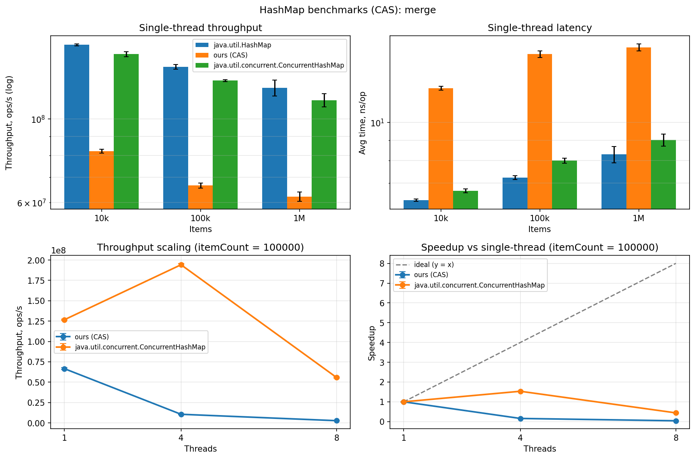
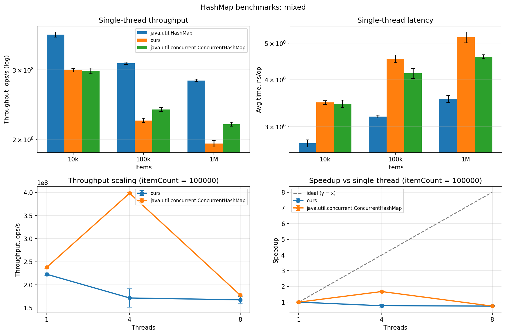
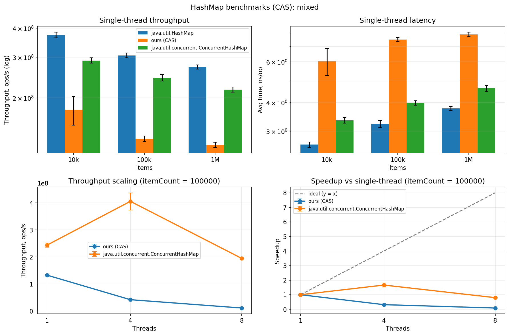

# Лабораторная работа 4: Concurrent Hash Map

## 1. Задание

Реализовать thread-safe хеш-таблицу с **закрытой адресацией** (separate chaining), обеспечив:

- минимальный набор операций: `put`, `get`, `size`, `clear`, `merge`, итератор по парам ключ-значение;
- **(почти) никогда не блокирующие** операции чтения;
- однозначный наблюдаемый порядок между завершёнными операциями.

Дополнительно по требованиям лабы:

- функциональные тесты на случайных наборах данных;
- бенчмарки с сравнением против не-thread-safe реализации;
- concurrency-тесты специализированным инструментом (jcstress);
- графики по числовым результатам и их объяснение;
- профилирование CPU и памяти с анализом узких мест.

---

## 2. Реализация

Файл: [`src/main/java/org/example/ConcurrentHashMap.java`](src/main/java/org/example/ConcurrentHashMap.java).

### Операции и семантика

| Операция | Семантика |
|----------|-----------|
| `get(k)` | lock-free чтение; возвращает значение или `null` |
| `put(k, v)` | вставка либо перезапись существующего; возвращает старое значение |
| `merge(k, v, fn)` | **атомарное** «вставить или пересчитать значение по старому» под локом |
| `size()` | приближённо-точный счётчик через `LongAdder` |
| `clear()` | полная очистка под захватом всех локов |
| `iterator()` | weakly consistent обход без локов |

Семантика `merge` критична: между чтением старого значения и записью нового никакой другой поток не вклинивается, поэтому нет lost updates. Это требование «однозначного наблюдаемого порядка между завершёнными операциями» из задания.

Итератор — **weakly consistent** (как у `java.util.concurrent.ConcurrentHashMap`): снимает снимок ссылки на таблицу при создании, не бросает `ConcurrentModificationException`, безопасен при параллельных модификациях. Каждый ключ из снимка возвращается один раз; параллельно добавленные ключи могут как появиться, так и нет.

### Функциональные тесты

Файл: [`src/test/java/org/example/ConcurrentHashMapTest.java`](src/test/java/org/example/ConcurrentHashMapTest.java). 9 тестов, все стабильно зелёные (прогон 5 раз подряд):

| Тест | Что проверяет |
|------|---------------|
| `putGetSize` | базовые операции, возврат старого значения |
| `clear` | сброс мапы |
| `resizeKeepsAllEntries` | 100k вставок — ни одна нода не потеряна при ресайзах |
| `mergeSums` | счётчик через `merge(k, 1, sum)` |
| `randomMatchesJdk` | 50k случайных операций — сверка с `java.util.HashMap` |
| `iteratorYieldsAllEntries` | итератор видит все элементы |
| `concurrentDisjointPuts` | 8 потоков × 50k непересекающихся ключей |
| `concurrentMergeSums` | 8 потоков × 100k инкрементов на 16 ключей — точная сумма |
| `concurrentReadDuringWrites` | читатели не видят `null` для предзаписанных ключей |

---

## 3. Архитектура

### Ключевые решения

| Решение | Зачем |
|---------|-------|
| **Stripe-локи** (32 `ReentrantLock`-а) | writer-ы в разные «полосы» не блокируют друг друга |
| **`AtomicReferenceArray` для таблицы корзин** | каждая ячейка имеет volatile-семантику — записи writer-а видны reader-у без локов |
| **`volatile V value`, `volatile Node next`** | reader идёт по цепочке без локов и видит свежие значения |
| **`cap ≥ NUM_STRIPES`** | одна корзина = один стрип-лок (см. п.2) |
| **`LongAdder` для счётчика** | конкурентные `++` без CAS-битвы за одну кешлайну |
| **Resize под `resizeLock` + захват всех 32 стрипов** | сериализация resize, читатели работают на старом снимке |

### Путь чтения (lock-free)

`get` не берёт ни одного лока: читает `volatile` ссылку на таблицу → достаёт голову корзины через `AtomicReferenceArray.get` (volatile) → идёт по цепочке через `volatile Node.next` → возвращает `volatile V value`. Видимость записей обеспечена JMM-гарантиями volatile-переходов. Это и есть «(почти) никогда не блокирующие чтения».

### Путь записи

`put`/`merge` определяют стрип по хешу, берут его `ReentrantLock`, под локом проходят цепочку и либо перезаписывают `value`, либо добавляют новую ноду в голову корзины. Под локом находится только одна из 32 «полос» — остальные writer-ы и все reader-ы продолжают работать.

### Resize

При превышении порога один поток под `resizeLock` захватывает все 32 стрипа, строит **новый** массив вдвое большего размера, создавая **новые** ноды (старые не мутирует), затем атомарно публикует новую таблицу через volatile-запись. Активные итераторы и in-flight читатели продолжают работать на старом снимке корректно.

---

## 4. Бенчмарки

Файл: [`src/test/java/org/example/performance/HashMapBenchmark.java`](src/test/java/org/example/performance/HashMapBenchmark.java).

### Методология

-  3 форка, 3 warmup × 1с, 5 measurement × 1с — 15 сэмплов на точку
- Batch 1024 операций на инвокацию — амортизирует JMH-оверхед
- `Blackhole` для возвратов — JIT не выкидывает «мёртвый» код
- Pre-boxed `Integer[]` ключи/значения — boxing вынесен из горячего цикла
- Два режима: `Throughput` (ops/sec) и `AverageTime` (ns/op, для итератора ms/op)
- Параметры: `itemCount` ∈ {10k, 100k, 1M}; `impl` ∈ {`SIMPLE`=`java.util.HashMap`, `CONCURRENT`=наш, `JDK`=`java.util.concurrent.ConcurrentHashMap`}; threads ∈ {1, 4, 8} (`SIMPLE` только t=1, т.к. не потокобезопасна)

> В таблицах ниже наша реализация показана двумя колонками: **CONCURRENT-lock** — исходная версия на 32 stripe-локах, **CONCURRENT-CAS** — переписанная на CAS (`results/cas/`). `SIMPLE`/`JDK`/`CONCURRENT-lock` — из первого прогона, `CONCURRENT-CAS` снят отдельным прогоном на той же машине и той же методике (15 сэмплов, 99.9% CI). Все числа — срез `itemCount=100000`, throughput в M ops/s.

### `get` — lock-free чтение

| Threads | SIMPLE (java.util.HashMap) | CONCURRENT-lock | CONCURRENT-CAS | JDK CHM |
|---------|---------------------------|-----------------|----------------|---------|
| 1 | 437 ± 3.3 | 295 ± 12.6 | 190 ± 19.0 | 314 ± 4.5 |
| 4 | — | 879 ± 3.2 | 575.6 ± 6.2 | 926 ± 29 |
| 8 | — | 921 ± 2.0 | 730.8 ± 17.8 | 1074 ± 31 |

**Lock-версия (32 stripe-лока):**

**CAS-версия:**

- На 1 потоке `java.util.HashMap` быстрее нас на ~треть — это **чистая цена потокобезопасности** без конкуренции: volatile-чтения вместо обычных, нет register-кеширования. На одном потоке concurrent-структура в принципе не может обогнать обычную.
- **Read scaling почти линейный**: ×3.1 при переходе t=1→t=8. Это эмпирическое доказательство, что чтения lock-free — потоки реально не мешают друг другу.
- Отставание от JDK CHM ~15% при t=8 — у них `VarHandle`-доступ дешевле `AtomicReferenceArray` плюс treeify длинных цепочек.
- **CAS-версия** на t=1 медленнее lock (190 vs 295) — `value` стал `AtomicReference`, лишняя разыменовка на каждой ноде. Но масштабируется так же (×3.8: 190→731), т.к. чтение осталось lock-free.

### `put` — запись через stripe-лок

| Threads | SIMPLE | CONCURRENT-lock | CONCURRENT-CAS | JDK CHM |
|---------|--------|-----------------|----------------|---------|
| 1 | 237 ± 15 | 132 ± 4.6 | 67.1 ± 3.1 | 97 ± 0.5 |
| 4 | — | 54 ± 2.8 | 11.5 ± 0.1 | 160 ± 5.2 |
| 8 | — | 42 ± 4.1 | 2.7 ± 0.2 | 61 ± 1.4 |

**Lock-версия (32 stripe-лока):**

**CAS-версия:**

- При t=1 мы **обгоняем JDK CHM** — взять незанятый `ReentrantLock` дешевле JDK-шного пути с CAS на пустые корзины и synchronized на head.
- При t=4 переворот: **JDK 3× быстрее** — у них гранулярность на уровне корзины, у нас 32 корзины делят один стрип.
- Наш throughput с ростом потоков **падает** (132 → 54 → 42) — типичная картина contention bottleneck: больше потоков на 32 стрипах = больше ожидания.
- **CAS-версия** обваливается ещё резче (67 → 11.5 → **2.7**, speedup < 1): на каждый `put` берётся общий read-лок `ReentrantReadWriteLock`, и все писатели бьют CAS по одному счётчику AQS — горлышко переехало с 32 стрипов на одну кеш-линию (см. профиль `put-cpu` в п.5).

### `merge` — атомарное обновление под локом

| Threads | SIMPLE | CONCURRENT-lock | CONCURRENT-CAS | JDK CHM |
|---------|--------|-----------------|----------------|---------|
| 1 | 136 ± 2.1 | 111 ± 5.2 | 66.6 ± 1.0 | 125 ± 1.4 |
| 4 | — | 58 ± 4.1 | 10.6 ± 0.4 | 178 ± 3.1 |
| 8 | — | 42 ± 1.0 | 2.7 ± 0.2 | 57 ± 0.5 |

**Lock-версия (32 stripe-лока):**

**CAS-версия:**

- Картина как у `put` — атомарность требует лока, страдает от того же contention.
- Артефакт: JDK CHM на t=4 даёт аномальные 178M, но на t=8 «обваливается» до 57M — внутренний lock-free fast path JDK при высокой конкуренции чаще проваливается в slow path с synchronized.
- **CAS-версия** ведёт себя как `put` (67 → 10.6 → 2.7): атомарность держится на CAS-петле `value.compareAndSet`, но тот же общий read-лок душит масштабирование.

### `mixed` — реалистичная нагрузка 80% read / 20% write

| Threads | SIMPLE | CONCURRENT-lock | CONCURRENT-CAS | JDK CHM |
|---------|--------|-----------------|----------------|---------|
| 1 | 312 ± 2.0 | 223 ± 2.8 | 133.0 ± 3.6 | 238 ± 2.7 |
| 4 | — | 172 ± 19.9 | 42.1 ± 2.0 | 398 ± 2.1 |
| 8 | — | 168 ± 7.4 | 11.4 ± 0.3 | 178 ± 4.3 |

**Lock-версия (32 stripe-лока):**

**CAS-версия:**

- Самый реалистичный сценарий. При t=8 отстаём от JDK всего на ~6% — потому что 80% операций (чтения) у нас lock-free и почти как у JDK.
- **CAS-версия** проседает (133 → 42 → 11.4): 20% записей берут общий read-лок и тянут вниз даже read-heavy профиль, поэтому к t=8 отставание от JDK уже в ~15 раз, а не 6%.

## 5. Профили: CPU и Alloc

### CPU — `get` (lock-free путь)

**Lock-версия:** [`profiles/old/get-cpu/`](profiles/old/get-cpu/)

Горячий стек: `ConcurrentHashMap.get` → `AtomicReferenceArray.get` → `Node.equals`/чтение `value`. **Ни одного кадра** на `LockSupport.park`/`ReentrantLock.lock` — визуальное подтверждение lock-free чтения.

**CAS-версия:** [`profiles/cas/get-cpu/`](profiles/cas/get-cpu/)

То же и на CAS: во флейм-графе нет ни одного лок-кадра (`ReentrantReadWriteLock`/`acquireShared`/`park`), только `ConcurrentHashMap.get` → `AtomicReferenceArray.get` → `AtomicReference.get`. Чтение осталось lock-free.

### CPU — `put` (где время на запись)

**Lock-версия:** [`profiles/old/put-cpu/`](profiles/old/put-cpu/) · сравнение JDK: [`profiles/old/put-cpu-jdk/`](profiles/old/put-cpu-jdk/)

У нас заметная доля сэмплов (~15-20%) на `ReentrantLock.lock`/`unlock`. У JDK на том же сценарии вместо стрип-лока — synchronized на голову корзины, и «ножка» блокировок тоньше: визуализация того, почему JDK быстрее на write-heavy (тоньше гранулярность). Lock-профили `put`/`merge` ([`profiles/put-lock/`](profiles/old/put-lock/), [`profiles/merge-lock/`](profiles/old/merge-lock/), [`profiles/put-lock-jdk/`](profiles/old/put-lock-jdk/)) подтверждают: основное узкое место — ожидание на стрип-локах.

**CAS-версия (8 потоков):** [`profiles/cas/put-cpu/`](profiles/cas/put-cpu/)

После перехода на CAS горячая точка записи переехала с 32 stripe-локов на **единственный** `ReentrantReadWriteLock`. Во флейм-графе доминируют кадры `AbstractQueuedSynchronizer.acquireShared` → `fullTryAcquireShared` → `compareAndSetState`: все писатели на каждый `put`/`merge` бьют CAS-ом по одному атомарному счётчику держателей read-лока (одна кеш-линия). Это и есть причина обвала записи с ростом потоков (см. п.4) — узкое место не сами вставки, а общий лок.

### CPU — `iterator`

[`profiles/iterator-cpu/`](profiles/old/iterator-cpu/)

Простой стек `EntryIterator.next` → `AtomicReferenceArray.get` → `Node.next`, без локов. Объясняет, почему мы быстрее JDK CHM на итерации.

### Alloc — `put`

**Lock-версия:** [`profiles/old/put-alloc/`](profiles/old/put-alloc/)

Топ источников аллокаций:
1. `new Node<>(...)` — каждая успешная вставка создаёт ноду.
2. `Integer.valueOf` — autoboxing при возврате старого значения и сравнении ключей.

Всё уходит в young generation, GC-пауз не вызывает.

**CAS-версия:** [`profiles/cas/put-alloc/`](profiles/cas/put-alloc/)

На этом сценарии все ключи уже присутствуют, поэтому `put` идёт по ветке **обновления** — `value.compareAndSet(prev, value)` без создания ноды; флейм аллокаций почти пустой. Новый объект появляется только при вставке нового ключа, и в CAS-версии их теперь **два** на ноду: сам `Node` + обёртка `AtomicReference<V>` для `value` (в lock-версии `value` было простым `volatile` полем без отдельного объекта).

---

## 6. Тесты конкурентности (JCStress)

Файлы в [`src/main/java/org/example/jcstress/`](src/main/java/org/example/jcstress/).

| Тест | Сценарий | Ожидание |
|------|----------|----------|
| `PutGetStress` | T1: `put(1,1)`, T2: `get(1)` | исход 0 или 1 — оба ACCEPTABLE |
| `PutPutStress` | T1: `put(1,1)`, T2: `put(1,2)`, арбитр читает | исход 1 или 2 — детерминированный победитель |
| `MergeStress` | T1: `merge(1,1,sum)`, T2: то же | исход **строго 2**; «1» (lost update) — FORBIDDEN |

Результат прогона — обе версии зелёные на одной и той же матрице:

| Версия | Результат |
|--------|-----------|
| Lock | `204 planned; 204 passed, 0 failed, 0 soft errs, 0 hard errs` |
| **CAS** | `204 planned; 204 passed, 0 failed, 0 soft errs, 0 hard errs` |

Разбивка наблюдаемых исходов (CAS-версия):

| Тест | Исход | Частота | Вердикт |
|------|-------|---------|---------|
| `MergeStress` | `2` — оба инкремента учтены | 100,00% | Acceptable |
| `MergeStress` | `1` — lost update | **0,00%** (0 сэмплов) | **Forbidden** ✓ |
| `PutGetStress` | `0` — get до put | 88,0% | Acceptable |
| `PutGetStress` | `1` — get после put | 12,0% | Acceptable |
| `PutPutStress` | `1` / `2` — победил writer 1 / 2 | ~50 / 50% | Acceptable |

Ключевой тест — `MergeStress`: исход «1» (lost update) **не наблюдался ни разу** (0 из ~16,6 млн сэмплов). В CAS-версии атомарность `merge` держится не на локе, а на CAS-петле `value.compareAndSet` с ретраем: проигравший гонку поток пересчитывает значение на свежем, поэтому lost update невозможен. Это эмпирическое подтверждение «однозначного наблюдаемого порядка между завершёнными операциями».

`PutGetStress` подтверждает корректность взаимодействия lock-free чтения с CAS-записью (читатель видит либо старое `0`, либо новое `1`, без «битых» промежуточных). `PutPutStress` — что при гонке двух писателей есть детерминированный победитель, а не повреждённые данные.

HTML-отчёты: lock — [`results/old/index.html`](results/old/index.html) · CAS — [`results/cas/jcstress/index.html`](results/cas/jcstress/index.html).
