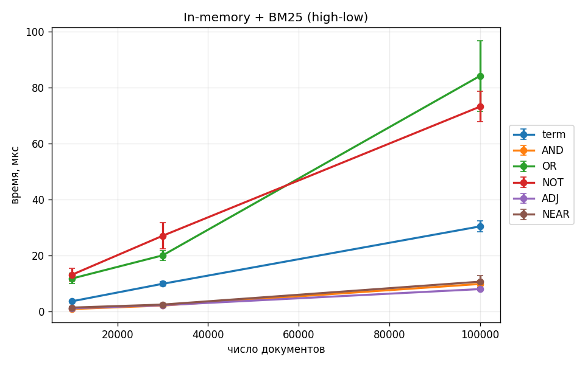
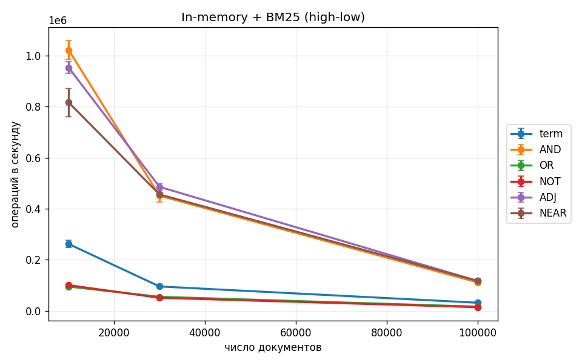
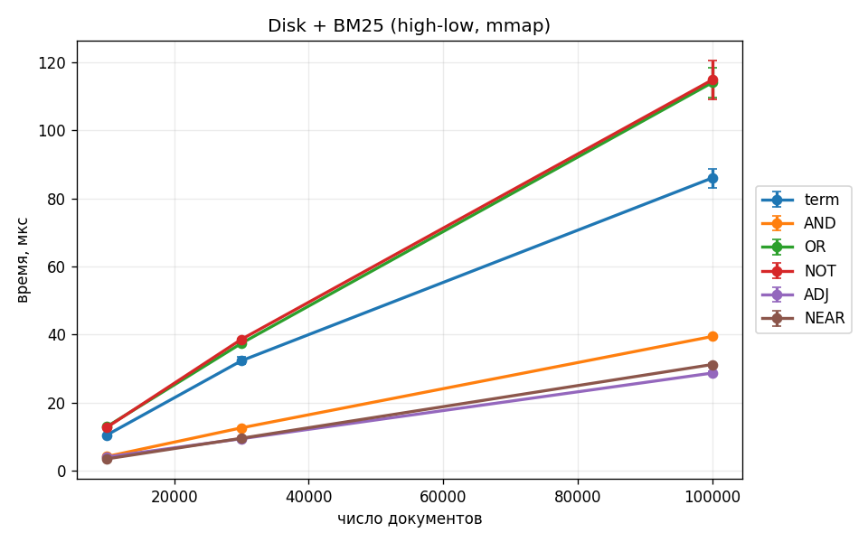
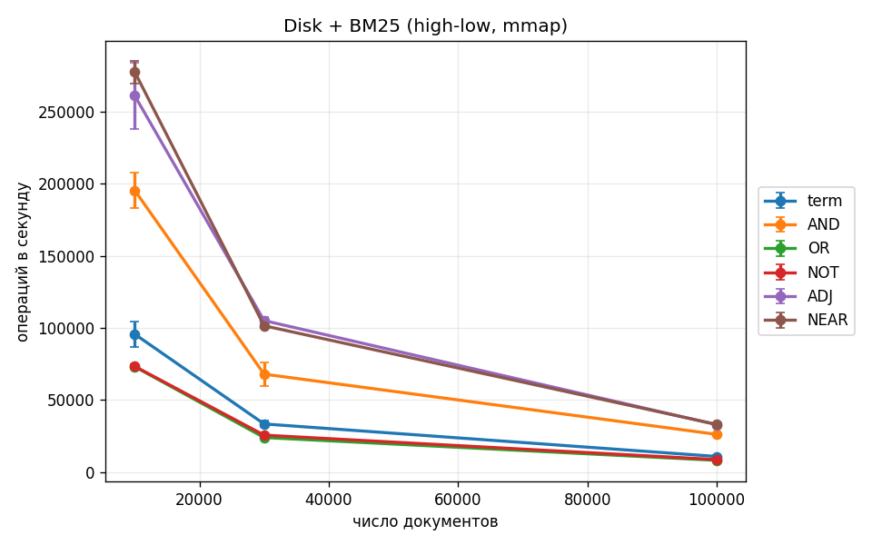

# Отчёт — лабораторная 5 (inverted index)

## Методика бенчмарков

- **JMH**, 2 fork, warmup 5×1 s, measurement **15×1 s**.
- Индекс строится в `@Setup(Level.Trial)`, **не** в цикле бенчмарка.
- Измеряется **`Finder.search(query, 10)`** — полный пайплайн: парсинг → matching → BM25 → top-10.
- **Одинаковые пары термов** для AND / OR / AND NOT / ADJ / NEAR (профиль **high-low**: частый `term0..299` + редкий `term10000..15000`).
- **NOT:** только `termA AND NOT termB` (не `termA NOT termB`).

### Почему времена выглядят так

| Оператор | Ожидание | Причина |
|----------|----------|---------|
| **term** | базовая линия | один posting list + BM25 по всем hits |
| **AND** | быстрее **OR** | пересечение списков + skip / advance; меньше кандидатов для BM25 |
| **OR** | медленнее **AND** | объединение больших списков, больше документов для скоринга |
| **NOT** | часто медленнее AND | дополнение множества: обход docId 0..N−1 |
| **ADJ / NEAR** | ≈ AND или чуть медленнее | после пересечения — проверка позиций в документе |

```bash
mvn package -DskipTests
java -jar target/benchmarks.jar MemBench -rf csv -rff results-mem.csv
java -jar target/benchmarks.jar DiskBench -rf csv -rff results-disk.csv
python3 scripts/plot_bench.py results-mem.csv results-disk.csv -o plots
```

## Поиск в памяти — время



In-memory + BM25. Время запроса (мкс) для term / AND / OR / NOT / ADJ / NEAR на 10k / 30k / 100k документах.

## Поиск в памяти — throughput



## Поиск на диске — время



Дисковый индекс: mmap + PForDelta (doc gaps) + BitPack (freqs, positions).

## Поиск на диске — throughput



## Сжатие

Формат **IVX1**: posting lists блочно — gaps через **PForDelta**, freqs/positions через **BitPack**; длины документов — BitPack.

Проверка на wiki-индексе:

```bash
java -cp target/classes org.example.WikiMain stats wiki.idx
```

Показывает размер файла, число posting/positions и **compression ratio** (сырые int32 vs размер `.idx`). Типично **~4–5×** на 10k–100k статей.

PForDelta эффективен на **monotonic doc gaps** (малые дельты в блоке); BitPack — на **freq/position** с малым числом бит.
